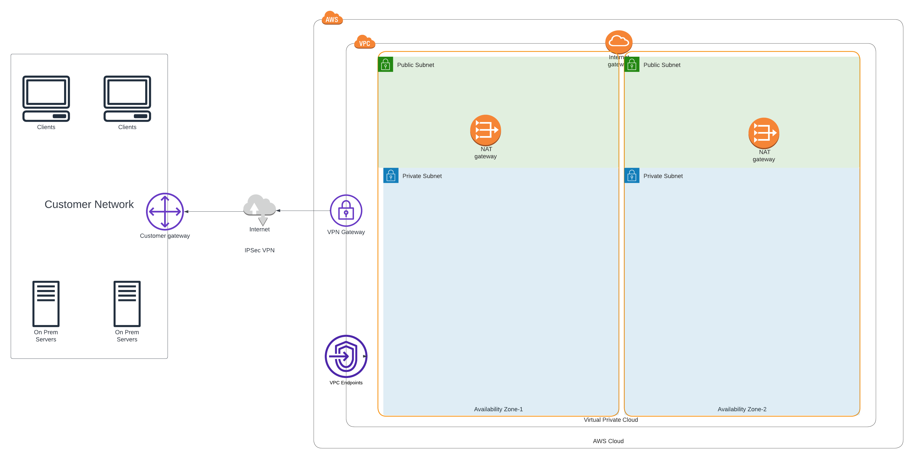

# [terraform-aws-arc-network](https://github.com/sourcefuse/terraform-aws-arc-network)

<a href="https://github.com/sourcefuse/terraform-aws-arc-network/releases/latest"></a> <a href="https://github.com/sourcefuse/terraform-aws-arc-network/commits"></a>  

[](https://sonarcloud.io/summary/new_code?id=sourcefuse_terraform-aws-arc-network)

[](https://github.com/sourcefuse/terraform-aws-ref-arch-network/actions/workflows/snyk.yaml)
## Introduction

SourceFuse's AWS Reference Architecture (ARC) Terraform module facilitates the management of AWS VPC and associated networking resources. It includes features like VPC creation, Client VPN, and VPC endpoints for services like S3 and DynamoDB, enhancing network connectivity and security.

For more information about this repository and its usage, please see [Terraform AWS ARC Network Module Usage Guide](docs/module-usage-guide/README.md).



Create the following resources in a single region.

* VPC
* Multi-AZ private and public subnets
* Route tables, internet gateway, and NAT gateways
* Configurable VPN Gateway
* Configurable Client VPN Endpoint
* Configurable VPC Endpoints

### Prerequisites
Before using this module, ensure you have the following:

- AWS credentials configured.
- Terraform installed.
- A working knowledge of Terraform.

## Usage
See the `examples` folder for a complete example.

```shell

module "network" {
  source                      = "sourcefuse/arc-network/aws"
  version                     = "2.6.10"
  namespace                   = var.namespace
  environment                 = var.environment
  availability_zones          = var.availability_zones
  vpc_ipv4_primary_cidr_block = var.vpc_ipv4_primary_cidr_block
  client_vpn_enabled          = false
  tags                        = module.tags.tags
  client_vpn_authorization_rules = [
    {
      target_network_cidr  = var.vpc_ipv4_primary_cidr_block
      authorize_all_groups = true
      description          = "default authorization group to allow all authenticated clients to access the vpc"
    }
  ]

  vpc_endpoint_config = {
    s3         = true
    kms        = false
    cloudwatch = false
    elb        = false
    dynamodb   = true
    ec2        = false
    sns        = true
    sqs        = true
    ecs        = true
    rds        = true
  }
  gateway_endpoint_route_table_filter = ["*private*"]
}

```
## custom-subnets example

```shell

module "network" {
  source                      = "sourcefuse/arc-network/aws"
  version                     = "2.6.10"

  namespace                   = var.namespace
  environment                 = var.environment
  availability_zones          = var.availability_zones
  vpc_ipv4_primary_cidr_block = var.vpc_ipv4_primary_cidr_block
  client_vpn_enabled          = true

  ## custom subnets
  custom_subnets_enabled = true
  custom_private_subnets = [
    {
      name              = "${var.namespace}-${var.environment}-private-${var.region}a"
      availability_zone = "${var.region}a"
      cidr_block        = "10.0.0.0/19"
    },
    {
      name              = "${var.namespace}-${var.environment}-private-${var.region}b"
      availability_zone = "${var.region}b"
      cidr_block        = "10.0.64.0/19"
    }
  ]
  custom_public_subnets = [
    {
      name              = "${var.namespace}-${var.environment}-public-${var.region}a"
      availability_zone = "${var.region}a"
      cidr_block        = "10.0.96.0/20"
    },
    {
      name              = "${var.namespace}-${var.environment}-public-${var.region}b"
      availability_zone = "${var.region}b"
      cidr_block        = "10.0.112.0/20"
    }
  ]

  // If have disabled the default nat gateways for your custom subnetes
  // then you need to pass a nat gateway id for each private subnet that
  // you are creating. If custom_az_ngw_ids is left empty in this case
  // then no default route is created by the module.

  custom_nat_gateway_enabled = false
  custom_az_ngw_ids = {
    "us-east-1a" = "ngw-13df3f3" // Dummy NAT gateway IDs. Use data sources or resource attributes instead.
    "us-east-1b" = "ngw-12cesc3"
  }

  client_vpn_authorization_rules = [
    {
      target_network_cidr  = var.vpc_ipv4_primary_cidr_block
      authorize_all_groups = true
      description          = "default authorization group to allow all authenticated clients to access the vpc"
    }
  ]
  // if no vpc endpoint is required then you can remove this block with gateway_endpoint_route_table_filter
  vpc_endpoint_config = {
    s3         = true
    kms        = false
    cloudwatch = false
    elb        = false
    dynamodb   = true
    ec2        = false
    sns        = true
    sqs        = true
    ecs        = true
    rds        = true
  }

  gateway_endpoint_route_table_filter = ["*private*"]

  tags = module.tags.tags
}


```

## Configuring your VPN Client

Please reference the [AWS Documentation](https://docs.aws.amazon.com/vpn/latest/clientvpn-admin/cvpn-working-endpoint-export.html) on how to configure the client
once the VPN has been configured in AWS.

The pki keys and certificates can be obtained from the respective SSM parameters and can be used
to generate client certificate for mutual authentication using easy-rsa.

You shall need to copy the ca cert and ca key to:

/path/etc/pki/ca.crt

and

/path/etc/pki/private/ca.key

respectively to use the ca certificate and key generated in this module for mutual auth.

<!-- BEGINNING OF PRE-COMMIT-TERRAFORM DOCS HOOK -->
## Requirements

| Name | Version |
|------|---------|
| <a name="requirement_terraform"></a> [terraform](#requirement\_terraform) | >= 1.3, < 2.0.0 |
| <a name="requirement_aws"></a> [aws](#requirement\_aws) | >= 4.0, < 6.0 |
| <a name="requirement_awsutils"></a> [awsutils](#requirement\_awsutils) | >= 0.15 |

## Providers

| Name | Version |
|------|---------|
| <a name="provider_aws"></a> [aws](#provider\_aws) | 4.57.0 |

## Modules

No modules.

## Resources

| Name | Type |
|------|------|
| [aws_eip.nat_gw](https://registry.terraform.io/providers/hashicorp/aws/latest/docs/resources/eip) | resource |
| [aws_internet_gateway.this](https://registry.terraform.io/providers/hashicorp/aws/latest/docs/resources/internet_gateway) | resource |
| [aws_nat_gateway.this](https://registry.terraform.io/providers/hashicorp/aws/latest/docs/resources/nat_gateway) | resource |
| [aws_route.additional](https://registry.terraform.io/providers/hashicorp/aws/latest/docs/resources/route) | resource |
| [aws_route.internet_gw](https://registry.terraform.io/providers/hashicorp/aws/latest/docs/resources/route) | resource |
| [aws_route.nat](https://registry.terraform.io/providers/hashicorp/aws/latest/docs/resources/route) | resource |
| [aws_route_table.this](https://registry.terraform.io/providers/hashicorp/aws/latest/docs/resources/route_table) | resource |
| [aws_route_table_association.additional](https://registry.terraform.io/providers/hashicorp/aws/latest/docs/resources/route_table_association) | resource |
| [aws_route_table_association.this](https://registry.terraform.io/providers/hashicorp/aws/latest/docs/resources/route_table_association) | resource |
| [aws_subnet.this](https://registry.terraform.io/providers/hashicorp/aws/latest/docs/resources/subnet) | resource |
| [aws_vpc.this](https://registry.terraform.io/providers/hashicorp/aws/latest/docs/resources/vpc) | resource |
| [aws_vpc_endpoint.this](https://registry.terraform.io/providers/hashicorp/aws/latest/docs/resources/vpc_endpoint) | resource |
| [aws_region.this](https://registry.terraform.io/providers/hashicorp/aws/latest/docs/data-sources/region) | data source |
| [aws_route_tables.private](https://registry.terraform.io/providers/hashicorp/aws/latest/docs/data-sources/route_tables) | data source |
| [aws_route_tables.public](https://registry.terraform.io/providers/hashicorp/aws/latest/docs/data-sources/route_tables) | data source |
| [aws_subnets.private](https://registry.terraform.io/providers/hashicorp/aws/latest/docs/data-sources/subnets) | data source |
| [aws_subnets.public](https://registry.terraform.io/providers/hashicorp/aws/latest/docs/data-sources/subnets) | data source |

## Inputs

| Name | Description | Type | Default | Required |
|------|-------------|------|---------|:--------:|
| <a name="input_assign_generated_ipv6_cidr_block"></a> [assign\_generated\_ipv6\_cidr\_block](#input\_assign\_generated\_ipv6\_cidr\_block) | Requests an Amazon-provided IPv6 CIDR block with a /56 prefix length for the VPC. | `bool` | `false` | no |
| <a name="input_availability_zones"></a> [availability\_zones](#input\_availability\_zones) | (optional) List of availability zones , if subnet map is null , subnet map autimatically derived | `list(string)` | `[]` | no |
| <a name="input_cidr_block"></a> [cidr\_block](#input\_cidr\_block) | The CIDR block for the VPC. | `string` | n/a | yes |
| <a name="input_create_internet_geteway"></a> [create\_internet\_geteway](#input\_create\_internet\_geteway) | (optional) Whether to create internet gateway | `bool` | `true` | no |
| <a name="input_enable_dns_hostnames"></a> [enable\_dns\_hostnames](#input\_enable\_dns\_hostnames) | A boolean flag to enable/disable DNS hostnames in the VPC. | `bool` | `true` | no |
| <a name="input_enable_dns_support"></a> [enable\_dns\_support](#input\_enable\_dns\_support) | A boolean flag to enable/disable DNS support in the VPC. | `bool` | `true` | no |
| <a name="input_enable_network_address_usage_metrics"></a> [enable\_network\_address\_usage\_metrics](#input\_enable\_network\_address\_usage\_metrics) | Enable or disable network address usage metrics. | `bool` | `false` | no |
| <a name="input_environment"></a> [environment](#input\_environment) | Environmenr name | `string` | n/a | yes |
| <a name="input_instance_tenancy"></a> [instance\_tenancy](#input\_instance\_tenancy) | A tenancy option for instances launched into the VPC. Can be 'default' or 'dedicated'. | `string` | `"default"` | no |
| <a name="input_internet_geteway_name"></a> [internet\_geteway\_name](#input\_internet\_geteway\_name) | (optional) If the Internet Gateway name is not provided, it will be automatically derived. | `string` | `null` | no |
| <a name="input_ipv4_ipam_pool_id"></a> [ipv4\_ipam\_pool\_id](#input\_ipv4\_ipam\_pool\_id) | The IPv4 IPAM pool ID from which to allocate the CIDR. | `string` | `null` | no |
| <a name="input_ipv4_netmask_length"></a> [ipv4\_netmask\_length](#input\_ipv4\_netmask\_length) | The netmask length of the IPv4 CIDR block to allocate to the VPC. | `number` | `null` | no |
| <a name="input_ipv6_cidr_block"></a> [ipv6\_cidr\_block](#input\_ipv6\_cidr\_block) | The IPv6 CIDR block to associate with your VPC. | `string` | `null` | no |
| <a name="input_ipv6_cidr_block_network_border_group"></a> [ipv6\_cidr\_block\_network\_border\_group](#input\_ipv6\_cidr\_block\_network\_border\_group) | The network border group of the IPv6 CIDR block. | `string` | `null` | no |
| <a name="input_ipv6_ipam_pool_id"></a> [ipv6\_ipam\_pool\_id](#input\_ipv6\_ipam\_pool\_id) | The IPv6 IPAM pool ID from which to allocate the CIDR. | `string` | `null` | no |
| <a name="input_ipv6_netmask_length"></a> [ipv6\_netmask\_length](#input\_ipv6\_netmask\_length) | The netmask length of the IPv6 CIDR block to allocate to the VPC. | `number` | `null` | no |
| <a name="input_name"></a> [name](#input\_name) | VPC name | `string` | n/a | yes |
| <a name="input_namespace"></a> [namespace](#input\_namespace) | Namespace name | `string` | n/a | yes |
| <a name="input_subnet_map"></a> [subnet\_map](#input\_subnet\_map) | A map defining the configuration of subnets, their attributes, and associated resources.<br>Each subnet configuration can include the following details:<br><br>- **name**: Name of the subnet.<br>- **cidr\_block**: CIDR block for the subnet.<br>- **availability\_zone**: The availability zone where the subnet is located.<br>- **enable\_resource\_name\_dns\_a\_record\_on\_launch**: Enable or disable DNS A records for EC2 instances launched in this subnet (default: false).<br>- **enable\_resource\_name\_dns\_aaaa\_record\_on\_launch**: Enable or disable DNS AAAA records for EC2 instances launched in this subnet (default: false).<br>- **map\_public\_ip\_on\_launch**: Specify whether to auto-assign a public IP for instances in this subnet (default: false).<br>- **ipv6\_native**: Enable or disable native IPv6 support for the subnet (default: false).<br>- **assign\_ipv6\_address\_on\_creation**: Whether to automatically assign an IPv6 address to instances launched in the subnet (default: false).<br>- **ipv6\_cidr\_block**: The IPv6 CIDR block associated with the subnet (optional).<br>- **enable\_dns64**: Enable or disable DNS64 in the subnet (default: false).<br>- **nat\_gateway\_name**: Name of the NAT Gateway attached to the subnet (optional).<br>- **create\_nat\_gateway**: Specify whether to create a NAT Gateway for the subnet (default: true).<br>- **attach\_nat\_gateway**: Specify whether to attach an existing NAT Gateway to the subnet (default: false).<br>- **attach\_internet\_gateway**: Specify whether to attach an Internet Gateway to the subnet (default: false).<br>- **additional\_routes**: List of additional routes to be added to the subnet route table, typically to route traffic to other services like Transit Gateway. Each route includes:<br>  - **type**: Type of resource (default: "transit-gateway").<br>  - **id**: The ID of the route target (e.g., a Transit Gateway ID).<br>  - **cidr\_block**: The destination CIDR block for the route.<br>  - **destination\_ipv6\_cidr\_block**: The destination IPV6 CIDR block for the route. | <pre>map(object({<br>    name                                           = string<br>    cidr_block                                     = string<br>    availability_zone                              = string<br>    enable_resource_name_dns_a_record_on_launch    = optional(bool, false)<br>    enable_resource_name_dns_aaaa_record_on_launch = optional(bool, false)<br>    map_public_ip_on_launch                        = optional(bool, false)<br>    ipv6_native                                    = optional(bool, false)<br>    assign_ipv6_address_on_creation                = optional(bool, false)<br>    ipv6_cidr_block                                = optional(string, null)<br>    enable_dns64                                   = optional(bool, false)<br>    nat_gateway_name                               = optional(string, null)<br>    create_nat_gateway                             = optional(bool, true)<br>    attach_nat_gateway                             = optional(bool, false)<br>    attach_internet_gateway                        = optional(bool, false)<br>    additional_routes = optional(list(object({<br>      type                        = optional(string, "transit-gateway") // possible values : network-interface ,transit-gateway, vpc-endpoint, vpc-peering-connection<br>      id                          = string<br>      destination_cidr_block      = optional(string, null)<br>      destination_ipv6_cidr_block = optional(string, null)<br>      }<br>    )), [])<br>  }))</pre> | `null` | no |
| <a name="input_tags"></a> [tags](#input\_tags) | (optional) Tags for VPC resources | `map(string)` | `{}` | no |
| <a name="input_vpc_endpoint_data"></a> [vpc\_endpoint\_data](#input\_vpc\_endpoint\_data) | (optional) List of VPC endpoints to be created | <pre>list(object({<br>    service             = string<br>    route_table_filter  = optional(string, "private") // possible values 'private' and 'public'<br>    policy_doc          = optional(string, null)<br>    private_dns_enabled = optional(bool, false)<br>    security_group_ids  = optional(list(string), [])<br>  }))</pre> | `[]` | no |

## Outputs

| Name | Description |
|------|-------------|
| <a name="output_default_route_table_id"></a> [default\_route\_table\_id](#output\_default\_route\_table\_id) | The Default Route Table ID for the VPC |
| <a name="output_id"></a> [id](#output\_id) | The VPC ID |
| <a name="output_igw_id"></a> [igw\_id](#output\_igw\_id) | Internet gateway ID for the VPC |
| <a name="output_main_route_table_id"></a> [main\_route\_table\_id](#output\_main\_route\_table\_id) | The Main Route Table ID for the VPC |
| <a name="output_private_subnet_ids"></a> [private\_subnet\_ids](#output\_private\_subnet\_ids) | Private subnet IDs |
| <a name="output_public_subnet_ids"></a> [public\_subnet\_ids](#output\_public\_subnet\_ids) | Public subnet IDs |
| <a name="output_vpc_cidr"></a> [vpc\_cidr](#output\_vpc\_cidr) | The VPC CIDR block |
| <a name="output_vpc_default_network_acl_id"></a> [vpc\_default\_network\_acl\_id](#output\_vpc\_default\_network\_acl\_id) | The ID of the network ACL created by default on VPC creation |
| <a name="output_vpn_endpoint_arn"></a> [vpn\_endpoint\_arn](#output\_vpn\_endpoint\_arn) | The ARN of the Client VPN Endpoint Connection. |
<!-- END OF PRE-COMMIT-TERRAFORM DOCS HOOK -->

## Development

### Prerequisites
- [terraform](https://learn.hashicorp.com/terraform/getting-started/install#installing-terraform)
- [terraform-docs](https://github.com/segmentio/terraform-docs)
- [pre-commit](https://pre-commit.com/#install)
- [golang](https://golang.org/doc/install#install)
- [golint](https://github.com/golang/lint#installation)

### Configurations
- Configure pre-commit hooks
  ```sh
  pre-commit install
  ```
- Configure golang deps for tests
  ```sh
  go get github.com/gruntwork-io/terratest/modules/terraform
  go get github.com/stretchr/testify/assert
  ```
### Git commits

while Contributing or doing git commit please specify the breaking change in your commit message whether its major,minor or patch

For Example

```sh
git commit -m "your commit message #major"
```
By specifying this , it will bump the version and if you dont specify this in your commit message then by default it will consider patch and will bump that accordingly

### Tests
- Tests are available in `test` directory
- In the test directory, run the below command
  ```sh
  go test -timeout 1800s
  ```

## Authors
This project is authored by:
- SourceFuse
